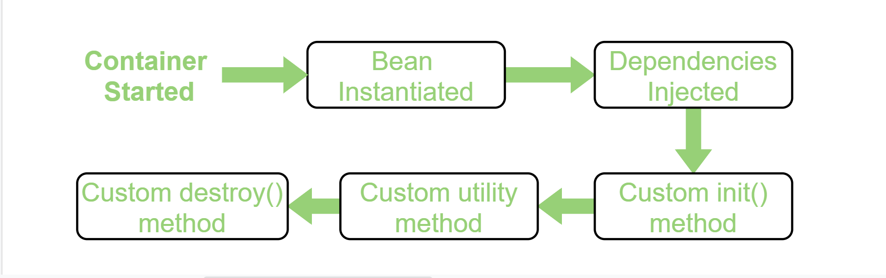

[Main page](../README.md)

# Spring

>#### What are components of Spring framework? 

Answer

The Spring Framework consists of features organized into about 20 modules. These modules are grouped into Core Container, 
Data Access/Integration, Web, AOP (Aspect Oriented Programming), Instrumentation, and Test, as shown in the following 
diagram.

>#### What is spring bean lifecycle?

Answer

Bean life cycle is managed by the spring container. When we run the program then, first of all, the spring container gets started. 
After that, the container creates the instance of a bean as per the request, and then dependencies are injected. And finally, the bean is destroyed when the spring container is closed. Therefore, if we want to execute some code on the bean instantiation and just after closing the spring container, then we can write that code inside the custom init() method and the destroy() method.

>#### What are spring bean scopes?

    
Answer

>#### `@Transactional` and its properties (Propagation, Isolation, readOnly, rollbackFor, noRollbackFor)

    
Answer

>#### What is SpringMVC (DispatcherServlet)?

    
Answer

>#### Differences between `@Controller` and `@RestController`

    
Answer

>#### Differences between dependency injection (DI) and inversion of control (IoT)

    
Answer

